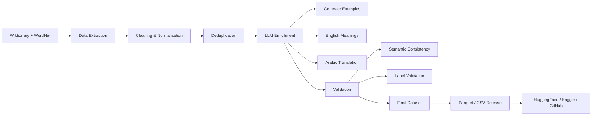

# IdiomX: English–Arabic Idiom Understanding Dataset

## IdiomX  
---

[](https://huggingface.co/datasets/aymansharara/IdiomX)
[](https://www.kaggle.com/datasets/aymansharara/idiomx)
[](https://doi.org/10.5281/zenodo.19137833)
[](LICENSE)
[]()
[]()
[]()
[]()

---

**A Large-Scale Bilingual Dataset for Idiomatic Expression Understanding**

**Author:** Ayman Ali Sharara  

**Affiliation:**  
MSc Data Science & Machine Learning (SPOC S21)  
DSTI School of Engineering  
https://dsti.school/

**Project Context:**  
Deep Learning with Python  
Supervised by Prof. Hanna Abi Akl  

**Contact:**  
- Academic: ayman.sharara@edu.dsti.institute  
- Personal: aymanshar@gmail.com  

---

## Overview

**IdiomX** is a large-scale, high-quality bilingual dataset designed for **idiomatic expression understanding**, including detection, interpretation, and cross-lingual analysis.

The dataset contains **over 123,000 contextualized examples** derived from approximately **15,000 English idioms**, enriched with semantic annotations and **English–Arabic translations**.

To the best of our knowledge, **IdiomX is the largest publicly available bilingual idiom dataset** with contextualized examples and semantic consistency validation.

--- 

## Note on Example Fields

The `example` column preserves examples as collected from the original source data and may contain missing values.

For modeling and analysis, the recommended contextual field is `idiom_in_example`, which provides the enriched example text used throughout the IdiomX pipeline.

---

## Dataset Statistics

| Metric | Value |
|------|------|
| Total examples | 123,336 |
| Unique idioms | 14,986 |
| Avg examples per idiom | 8.2 |
| Arabic coverage | 99.99% |
| Label balance | 50/50 |

---

## IdiomX Pipeline


---

## Languages

- English en  
- Arabic ar  

---

## Features

Each record includes:

- `idiom_canonical`
- `idiom_surface`
- `idiom_in_example`
- `idiom_in_example_meaning_en`
- `idiom_in_example_meaning_arabic`
- `idiom_canonical_meaning`
- `idiom_canonical_meaning_arabic`
- `example_usage_label` (idiomatic / literal)
- `semantic_consistency`
- Additional linguistic features

---

## Data Sources

This dataset is constructed from **high-quality lexical resources only**:

- **Wiktionary**
- **WordNet**
- **Enrichment by Generated Example and more informative fields using GPT LLM**

All other sources were excluded to ensure consistency and reliability.

---

## License
- MIT. License
- CC BY-SA 4.0 (Wiktionary-derived)
- WordNet License

---
## Dataset Construction

The dataset is built through a multi-stage pipeline:

1. **Data Collection**
   - Extract idioms from Wiktionary and WordNet

2. **Preprocessing**
   - Cleaning, normalization, deduplication

3. **LLM Enrichment**
   - Generate contextual examples
   - Generate English and Arabic meanings
   - Generate translations

4. **Validation**
   - Missing value analysis
   - Label consistency checks (>99.98%)
   - Semantic consistency scoring
   - Surface-form validation

---
## Run the pipeline using python files (CMD)
from anaconda CMD

go to root_folder/data_collection/scripts 

```bash
conda create -n idiomx python=3.11 -y
source $(conda info --base)/etc/profile.d/conda.sh
conda activate idiomx

pip install -r scripts/requirements.txt
```

run the python files in the same order
```bash
python extract_idioms_from_kaikki.py
python collect_02_filter_strict_idioms.py
python collect_03_clean_idioms.py
python collect_04_build_high_precision_idioms.py
python collect_05_normalize_kaikki_high_precision.py
python collect_09_extract_wordnet_multiword_expressions.py
python collect_10_merge_wordnet_with_kaikki.py
python collect_12_01_filter_global_idioms.py
python finalize_pre_enrichment_dataset.py
```
---
## Files

- `idiomx_pre_enrichment.parquet` → main dataset (recommended)
- `idiomx_pre_enrichment.csv → CSV version
- `idiomx_pre_enrichment_sample.csv`
- `idiomx_pre_enrichment_sample.parquet`
- `dataset_statistics.json` → dataset summary statistics

---

## Use Cases

IdiomX supports a wide range of NLP tasks:

- Idiom detection (idiomatic vs literal classification)
- Idiom interpretation and meaning retrieval
- Context-to-idiom generation
- Cross-lingual idiom translation
- Multilingual semantic understanding

---

## Limitations

- Some examples are generated using LLMs
- Minor annotation noise may exist (<0.01%)
- Idiomatic interpretation may vary across contexts

---

## Links

- HuggingFace: https://huggingface.co/datasets/aymansharara/IdiomX
- GitHub: https://github.com/aymanshar/idiomx-dataset
- Kaggle: https://www.kaggle.com/datasets/aymansharara/idiomx
- Zenodo: https://doi.org/10.5281/zenodo.19137833

---

## Paper

The full dataset paper is available here:

 `docs/IdiomX_Dataset_Paper_v1.pdf`

---

## Citation

If you use this dataset, please cite:

Sharara, Ayman Ali (2026). 
 
**IdiomX: A Large-Scale Bilingual Dataset for Idiomatic Expression Understanding**.  
Zenodo. https://doi.org/10.5281/zenodo.19137833

```bibtex
@article{sharara2026idiomx,
  title={IdiomX: A Large-Scale Bilingual Dataset for Idiomatic Expression Understanding},
  author={Sharara, Ayman Ali},
  year={2026},
  note={Dataset and paper available on GitHub and HuggingFace}
}
```