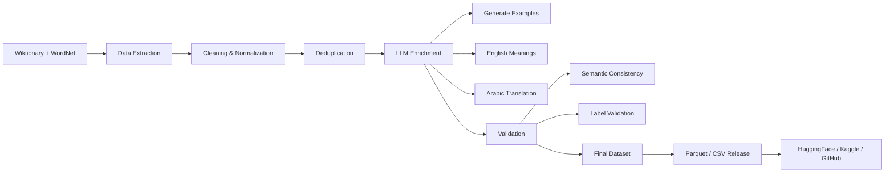

# IdiomX: English–Arabic Idiom Understanding Dataset
  
---

[](https://huggingface.co/datasets/aymansharara/IdiomX)
[](https://www.kaggle.com/datasets/aymansharara/idiomx)
[](https://doi.org/10.5281/zenodo.19137833)
[](LICENSE)
[]()
[]()
[]()
[]()

---

**A Large-Scale Bilingual Dataset for Idiomatic Expression Understanding**

**Author:** Ayman Ali Sharara  

**Affiliation:**  
MSc Data Science & Machine Learning (SPOC S21)  
DSTI School of Engineering  
https://dsti.school/

**Project Context:**  
Deep Learning with Python  
Supervised by Prof. Hanna Abi Akl  

**Contact:**  
- Academic: ayman.sharara@edu.dsti.institute  
- Personal: aymanshar@gmail.com  

---

## Overview

This repository contains the **official IdiomX dataset pipeline and final release used in the associated research paper**.

But to understand IdiomX, let’s start with a simple idea:

People often use expressions like  
“break the ice” or “spill the beans”  

These sentences don’t mean what the words say.  
They carry hidden meanings, and we call them **idioms**.

Humans understand this naturally.  
Computers and AI systems often do not.

For example, a system might interpret:  
“spill the beans” as something related to food  
while in reality it means **revealing a secret**  

---

### Why IdiomX?

Modern AI systems are very good at processing words,  
but they still struggle with **context and hidden meaning**.

This creates real problems in:
- translation systems  
- chatbots and assistants  
- language understanding tasks  

**IdiomX is designed to address this gap.**

It provides a large-scale, high-quality dataset that helps machines:
- understand idiomatic expressions  
- distinguish between literal and figurative meaning  
- learn from real contextual examples  
- connect meaning across languages (English ↔ Arabic)  

---

### What is IdiomX?

**IdiomX** is a large-scale, high-quality bilingual dataset designed for **idiomatic expression understanding**, including detection, interpretation, and cross-lingual analysis.

The dataset contains **174,956 contextualized examples** covering **12,823 English idioms**, enriched with semantic annotations and **English–Arabic translations**.

To the best of our knowledge, **IdiomX is the largest publicly available bilingual idiom dataset** that provides:
- Contextualized idiomatic and literal usage examples  
- Semantic consistency validation  
- High-coverage bilingual (English–Arabic) annotations  

The dataset is constructed through a multi-stage pipeline combining **lexical resources and LLM-based enrichment**, followed by rigorous validation and quality control.

---
### Modern Idioms & Slang Pipeline

A separate pipeline has been introduced to expand IdiomX with **modern expressions and slang**, including:

Sources:
- Urban Dictionary
- Wiktionary slang entries
- OpenSubtitles (dialogue-based expressions)

Pipeline steps:
1. Extraction from multiple sources
2. Cleaning and normalization
3. Merging and deduplication (idiom-level strict dedup)
4. High-precision filtering
5. LLM-based enrichment (examples, meanings, translations)
6. Schema alignment with IdiomX
7. Final merge preparation

This pipeline ensures:
- Coverage of real-world modern language
- Compatibility with the main IdiomX dataset

---

### Data Format

The final dataset is stored in **Parquet format** for efficiency and scalability:

- `idiomx_v3_with_similarity.parquet`

Additionally:

- Dataset is split into:
  - Train set
  - Test set

This ensures:
- Reproducibility
- Benchmark consistency
- Direct usability in ML pipelines

---

## Dataset Schema (Important)

The dataset contains two versions of contextual examples:

- `example_raw` → Original sentence collected from source data (may contain noise or missing values)
- `example` → Cleaned, normalized, and model-ready contextual sentence (recommended for all modeling tasks)

**Important:**  
All experiments, training, and evaluation should use the `example` column.

This design ensures:
- Full traceability to original data (`example_raw`)
- Clean input for machine learning (`example`)
---

## Dataset Statistics

| Metric | Value |
|--------|------|
| Total examples | 174,956 |
| Unique idioms | 12,823 |
| Unique normalized examples | 172,393 |
| Avg examples per idiom | 13.64 |
| Reuse factor | 1.01 |
| Idiomatic examples | 80,483 (46.00%) |
| Literal examples | 81,004 (46.30%) |
| Borderline examples | 13,469 (7.70%) |
| High-quality examples | 123,022|
| Language | English (with Arabic semantic fields) |

---

## Key Insights

- **High lexical diversity**
  - 172,393 unique normalized sentences across 174,956 rows  
  - Reuse factor ≈ 1.04 → minimal duplication  

- **Balanced contextual usage**
  - Idiomatic and literal examples are nearly evenly distributed  
  - Avoids bias in classification tasks  

- **123,022 High semantic quality examples ** 

- **Controlled ambiguity**
  - Borderline cases (~7.5%) simulate real-world uncertainty  

- **Rich linguistic annotations**
  - compositionality (transparent → opaque)  
  - register (formal, informal, slang, etc.)  
  - learner difficulty  
  - semantic similarity scores  

These properties make IdiomX a **robust benchmark for contextual idiom understanding**, requiring models to rely on semantic reasoning rather than surface patterns.

---

## IdiomX Pipeline



### ⚙️ Pipeline Structure

The dataset is built through a modular pipeline:

#### Core Idiom Pipeline
- collect_01 → collect_10 → finalize_pre_enrichment
- LLM enrichment (batch pipeline)
- validation + merging + final statistics

#### Modern Idioms Pipeline (NEW)
- collect_modern_01 → collect_modern_13
- modern LLM enrichment
- schema alignment
- merge-ready output

#### Final Steps
- Feature engineering (similarity, length, quality)
- Dataset validation
- Train/test split
- Parquet export


---

## Languages

- Example language: English  
- Meaning language: English  
- Additional fields: Arabic translations and semantic annotations  

This design supports both **monolingual semantic modeling** and **cross-lingual research (EN ↔ AR)**.

---

## Features

Each record includes:

### Derived Features

The dataset includes several computed features to support modeling and analysis:

| Feature | Description |
|--------|------------|
| sentence_length_chars | Number of characters in the example |
| sentence_length_words | Number of words in the example |
| semantic_similarity_example_vs_meaning | Embedding similarity between example and idiom meaning |
| semantic_quality | Quality label derived from similarity score (high / medium / low) |

### Multilingual Extension (NEW)

The dataset has been extended beyond English–Arabic to include **French semantic alignment**.

New fields include:

| Column | Description |
|--------|------------|
| idiom_canonical_meaning_french | French translation of idiom meaning |
| idiom_in_example_meaning_french | French contextual meaning |

This enables:
- Cross-lingual retrieval (EN ↔ AR ↔ FR)
- Multilingual semantic modeling
- Future expansion to additional languages

### Core Fields
- `idiom_id`
- `idiom_canonical`
- `idiom_surface`

### Core Text Fields

| Column | Description |
|------|-------------|
| idiom_canonical | Canonical idiom form |
| example | Main contextual sentence (LLM-generated, idiomatic or literal usage) |
| example_raw | Original source sentence collected from datasets (reference only) |
| example_normalized | Cleaned and normalized version of `example` |
| example_language | Language of the example |

### Meaning & Interpretation
- `idiom_canonical_meaning`
- `idiom_canonical_meaning_arabic`
- `idiom_in_example_meaning_en`
- `idiom_in_example_meaning_arabic`

### Quality & Validation
- `semantic_similarity_example_vs_meaning`
- `semantic_quality`
- `is_generated_example`
- `is_adversarial_example`

### Metadata
- `source`
- `source_type`
- `language`
- additional linguistic and enrichment features

---

## Data Sources

This dataset is constructed from **high-quality lexical resources only**:

- **Wiktionary**
- **WordNet**
- **LLM-based enrichment (context generation, semantic validation, bilingual translation)**

All other sources were excluded to ensure consistency and reliability.

---

## License
- MIT License
- CC BY-SA 4.0 (Wiktionary-derived)
- WordNet License

---

## Dataset Construction

The dataset is built through a multi-stage pipeline:

1. Data collection from Wiktionary and WordNet  
2. Cleaning, normalization, and deduplication  
3. LLM-based enrichment (examples, meanings, translations)  
4. Validation (semantic consistency, label accuracy, quality checks)

---

## Reproducibility

All dataset construction steps are fully reproducible via:

- Python scripts (modular pipeline)
- Batch LLM enrichment
- Deterministic processing stages

Final outputs can be regenerated from raw sources using the provided scripts.
---

## Pipeline Notebooks

The dataset is built using the following notebooks:

1. `01_data_collection.ipynb`
2. `02_data_enrichment_pipeline.ipynb`
3. `03_finalize_idiomx_dataset.ipynb`

These notebooks correspond to:

| Step | Description |
|------|------------|
| 01 | Data extraction and preprocessing |
| 02 | LLM enrichment and semantic augmentation |
| 03 | Final cleaning, splitting, and dataset export |

The final published dataset is produced in Step 03 (`03_finalize_idiomx_dataset.ipynb`).

---

## Run the pipeline using python files (CMD)
from anaconda CMD

Navigate to:
data_collection/scripts/

```bash
conda create -n idiomx python=3.11 -y
source $(conda info --base)/etc/profile.d/conda.sh
conda activate idiomx

pip install -r scripts/requirements.txt
```

run the python files in the same order
```bash
python collect_01_extract_idioms_from_kaikki.py
python collect_02_filter_strict_idioms.py
python collect_03_clean_idioms.py
python collect_04_build_high_precision_idioms.py
python collect_05_normalize_kaikki_high_precision.py
python collect_06_extract_wordnet_multiword_expressions.py
python collect_07_merge_wordnet_with_kaikki.py
python collect_08_filter_global_idioms.py
python collect_09_finalize_pre_enrichment_dataset.py
python collect_10_dataset_statistics.py
```
---

## Dataset Variants

IdiomX is released in multiple variants to support different research needs:

- **Full dataset:** 174,956 examples  
- **High-quality dataset:** 123,022 examples  

These variants allow flexible usage for:
- benchmarking
- controlled experiments
- high-precision modeling

---

## Files

### Main Dataset (Final)

- `idiomx_full.parquet`
- `idiomx_balanced.parquet`
- `idiomx_high_quality.parquet`

### Train/Test Splits

- `idiomx_train.parquet`
- `idiomx_test.parquet`
- `idiomx_balanced_train.parquet`
- `idiomx_balanced_test.parquet`
- `idiomx_high_quality_train.parquet`
- `idiomx_high_quality_test.parquet`

### Pre-Enrichment (Intermediate)

- `idiomx_pre_enrichment.parquet`
- `idiomx_pre_enrichment_sample.parquet`

### Metadata

- `dataset_statistics.json`

---

## Use Cases

IdiomX supports a wide range of NLP tasks:

- Idiom detection (idiomatic vs literal classification)
- Contextual idiom understanding under ambiguity
- Idiom interpretation and meaning retrieval
- Context-to-idiom generation
- Cross-lingual idiom translation
- Multilingual semantic understanding

---

## Limitations

- Some examples are generated using LLMs
- Minor annotation noise may exist (<0.01%)
- Idiomatic interpretation may vary across contexts

---

## Links

- HuggingFace: https://huggingface.co/datasets/aymansharara/IdiomX
- GitHub: https://github.com/aymanshar/idiomx-dataset
- Kaggle: https://www.kaggle.com/datasets/aymansharara/idiomx
- Zenodo: https://doi.org/10.5281/zenodo.19137833

---

## Paper

The full dataset paper is available here:

 `docs/IdiomX_Dataset_Paper_v6.pdf`

---

## Citation

If you use this dataset, please cite:

Sharara, Ayman Ali (2026). 
 
**IdiomX: A Large-Scale Bilingual Dataset for Idiomatic Expression Understanding**.  
Zenodo. https://doi.org/10.5281/zenodo.19137833

```bibtex
@article{sharara2026idiomx,
  title={IdiomX: A Large-Scale Bilingual Dataset for Idiomatic Expression Understanding},
  author={Sharara, Ayman Ali},
  year={2026},
  note={Dataset and paper available on GitHub and HuggingFace}
}
```