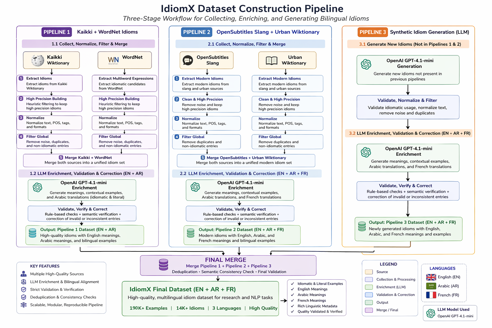

# IdiomX: Multilingual Idiom Understanding Dataset (EN–AR–FR)
---

[](https://huggingface.co/datasets/aymansharara/IdiomX)
[](https://huggingface.co/spaces/aymansharara/idiomx-studio)
[](https://github.com/aymanshar/IdiomX)
[](https://www.kaggle.com/datasets/aymansharara/idiomx)
[](https://doi.org/10.5281/zenodo.19137833)
[](LICENSE)
[]()
[]()
[]()
[]()


<p align="center">
  
</p>

*Three-stage reproducible pipeline for collecting, enriching, validating, and generating idioms.*

Dataset: 196K+ Examples | 12K+ Idioms | 3 Languages | 4 Tasks

---

**A Reproducible Multilingual Dataset and Construction Pipeline for Idiom Understanding**

**Author:** Ayman Ali Sharara  

**Affiliation:**  
MSc Data Science & Machine Learning (SPOC S21)  
DSTI School of Engineering  
https://dsti.school/

**Project Context:**  
Deep Learning with Python  
Supervised by Prof. Hanna Abi Akl  

**Contact:**  
- Academic: ayman.sharara@edu.dsti.institute  
- Personal: aymanshar@gmail.com  

---

## Overview

**IdiomX** is a large-scale **multilingual dataset** for **idiomatic expression understanding in context**.

It is designed to support multiple NLP tasks, including:

- Idiom Detection (idiomatic vs. literal)
- Context → Idiom Retrieval (English)
- Arabic → English Idiom Retrieval
- Multilingual semantic understanding (EN–AR–FR)

Idioms are difficult for NLP systems because their meanings are often **non-compositional**. Expressions such as *“spill the beans”* or *“kick the bucket”* cannot be understood correctly from individual words alone. IdiomX is designed to help models learn this distinction from rich contextual examples.

> This repository contains the full data collection and enrichment pipeline. 
> For the dataset only, see Hugging Face.

---

## Related Resources

- 🤗 Dataset: https://huggingface.co/datasets/aymansharara/IdiomX  
- 💻 Benchmark & Models Repo: https://github.com/aymanshar/IdiomX  
- 🎛 IdiomX Studio Demo (all 4 tasks): https://huggingface.co/spaces/aymansharara/idiomx-studio  
- 📦 Kaggle Mirror: https://www.kaggle.com/datasets/aymansharara/idiomx  
- 📄 Research Paper: docs/IdiomX_Dataset_Paper_v8.pdf

---

## At a Glance

- 196K+ contextualized examples  
- 12K+ idioms  
- 3 languages (EN–AR–FR)  
- 4 benchmark tasks  
- 3-stage reproducible construction pipeline  
- LLM enrichment + rule-based validation  
- Dataset + models + demos publicly released

---

## Why IdiomX Matters

Idiomatic language remains one of the most challenging phenomena for NLP systems, even with modern large language models.

IdiomX provides:
- large-scale contextual supervision
- controlled semantic variation
- cross-lingual alignment

This makes it a strong benchmark for evaluating real language understanding beyond surface-level text modeling.

---

## Dataset Scale

- ~196K contextualized examples
- ~12K+ unique idioms
- ~172K unique sentences
- ~14 examples per idiom
- Balanced labels (idiomatic / literal / borderline)
- Multilingual semantic alignment (EN–AR–FR)

---

## Key Features

- High semantic quality (validated pipeline)
- Balanced idiomatic vs literal examples
- Low duplication (reuse factor ≈ 1.04)
- Adversarial / hard-negative examples
- Multilingual alignment (EN–AR–FR)
- Modern idioms and slang coverage
- Synthetic expansion for missing idioms
- Fully reproducible pipeline


---

## Data Construction Pipeline

IdiomX is built through three reproducible pipelines:

| Pipeline | Purpose | Main Output |
|---|---|---|
| Pipeline 1 — Core Idioms | Extract idioms from Kaikki/Wiktionary and WordNet | High-precision idiom inventory |
| Pipeline 2 — Modern Idioms & Slang | Add modern and informal idioms from slang/conversational sources | Modern idiom extension |
| Pipeline 3 — Synthetic Idiom Generation | Generate and validate missing idioms using LLMs | Expanded idiom coverage |

All three pipelines are merged, deduplicated, enriched, validated, and exported into the final unified IdiomX dataset.

For the complete step-by-step script workflow, see:

[`docs/pipeline_steps.md`](docs/pipeline_steps.md)

---

## Environment Setup

```bash

conda create -n idiomx python=3.11 -y
conda activate idiomx
pip install -r scripts/requirements.txt

```
---

## Quick Reproduction

Clone and run:

```bash
git clone https://github.com/aymanshar/idiomx-dataset.git
cd idiomx-dataset

conda create -n idiomx python=3.11 -y
conda activate idiomx
pip install -r scripts/requirements.txt

python -m scripts.collect_01_extract_idioms_from_kaikki
```

---

## Repository Structure

```text
scripts/          # collection, enrichment, validation, export
notebooks/        # end-to-end workflow notebooks
data/             # raw, intermediate, final datasets
docs/             # paper and documentation
figures/          # diagrams and assets
artifacts/        # outputs and evaluation artifacts
```

---

## Pipeline Notebooks

The dataset workflow is also documented in notebooks:

1. `01_data_collection.ipynb`
2. `02_data_enrichment_pipeline.ipynb`
3. `03_finalize_idiomx_dataset.ipynb`
4. `04_finalize_idiomx_modern_dataset_v1.ipynb`
5. `05_merge_idiomX_and_modern_idiom.ipynb`
6. `06_merge_idiomX_modern_and_synth.ipynb`

These correspond to:

| Step | Description |
| --- | --- |
| 01 | Data extraction and preprocessing |
| 02 | LLM enrichment and semantic augmentation |
| 03 | Final cleaning, validation, and dataset export |
| 04 | finalize idiomx modern dataset v1 |
| 05 | merge idiomX and modern |
| 06 | final merge idiomX main, modern and synth |

---

## Final Dataset

All pipelines are merged into:

```
idiomx_full.parquet
```
---

## Dataset Schema

Each row represents a **contextualized idiom usage example**.

### Core Fields
- `idiom_id`
- `idiom_canonical`
- `example`
- `example_usage_label`
- `is_example_idiom`

### Semantics
- `idiom_canonical_meaning`
- `idiom_in_example_meaning_en`
- `idiom_in_example_meaning_arabic`
- `idiom_in_example_meaning_french`

### Quality
- `semantic_similarity_example_vs_meaning`
- `semantic_quality`

### Metadata
- `source`
- `source_type`
- `idiom_domain`
- `idiom_register`
- `compositionality`
- `learner_difficulty`

---

### Derived Features

| Feature | Description |
|--------|------------|
| sentence_length_chars | Number of characters |
| sentence_length_words | Number of words |
| semantic_similarity_example_vs_meaning | Embedding similarity |
| semantic_quality | High / Medium / Low |

---

## Dataset Statistics

| Metric | Value |
|--------|------|
| Total examples | ~196K |
| Unique idioms | ~12K+ |
| Unique sentences | ~190K |
| Avg examples per idiom | ~14 |
| Reuse factor | ~1.04 |
| Idiomatic examples | ~45–48% |
| Literal examples | ~45–48% |
| Borderline examples | ~5–8% |
| High-quality subset | ~123K |
| Languages | EN / AR / FR |

---

## Data Sources

- Wiktionary (Kaikki)
- WordNet
- Urban Dictionary
- OpenSubtitles
- LLM-based enrichment

All data undergo strict filtering and validation.

---

## Use Cases

IdiomX supports a wide range of NLP tasks:

* idiom detection
* contextual idiom understanding
* idiom retrieval
* cross-lingual semantic retrieval
* multilingual semantic modeling
* machine translation evaluation
* LLM fine-tuning
* semantic search

---

## Limitations

* Some examples are LLM-generated
* Minor annotation noise may still exist
* Idiomatic interpretation may vary across contexts
* Some multilingual fields may be more complete than others depending on source and enrichment stage

---

## License

- MIT License
- CC BY-SA 4.0 (Wiktionary-derived)
- WordNet License

---

## Reproducibility

All dataset construction steps are fully reproducible via:

- Python scripts (modular pipeline)
- Batch LLM enrichment
- Deterministic processing stages

Final outputs can be regenerated from raw sources using the provided scripts.
---

## Links

- HuggingFace: https://huggingface.co/datasets/aymansharara/IdiomX
- GitHub: https://github.com/aymanshar/idiomx-dataset
- Kaggle: https://www.kaggle.com/datasets/aymansharara/idiomx
- Zenodo: https://doi.org/10.5281/zenodo.19137833

---

## Paper

The full dataset paper is available here:

 `docs/IdiomX_Multilingual_Benchmark.pdf`

---

## Citation

If you use this dataset, please cite:

Sharara, Ayman Ali (2026). 
 
**IdiomX: A Multilingual Benchmark for Idiom Understanding, Retrieval, and Semantic Interpretation**.  
Zenodo. https://doi.org/10.5281/zenodo.19137833

```bibtex
@misc{sharara2026idiomx,
  title={IdiomX: A Multilingual Benchmark for Idiom Understanding, Retrieval, and Semantic Interpretation},
  author={Sharara, Ayman Ali},
  year={2026},
  note={Dataset, construction pipeline, benchmark code, and demos available on GitHub and Hugging Face}
}
```
---
## If you use this work

⭐ Star the repository  
🤗 Try IdiomX Studio  
📄 Cite the dataset and paper
---