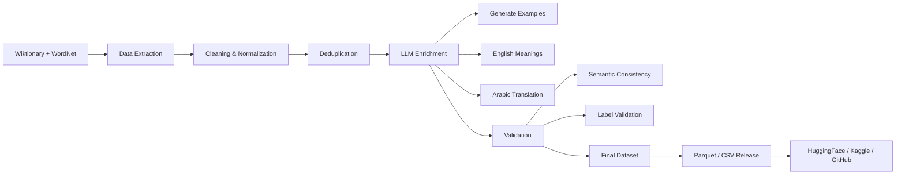

# IdiomX: English–Arabic Idiom Understanding Dataset
  
---

[](https://huggingface.co/datasets/aymansharara/IdiomX)
[](https://www.kaggle.com/datasets/aymansharara/idiomx)
[](https://doi.org/10.5281/zenodo.19137833)
[](LICENSE)
[]()
[]()
[]()
[]()

---

**A Large-Scale Bilingual Dataset for Idiomatic Expression Understanding**

**Author:** Ayman Ali Sharara  

**Affiliation:**  
MSc Data Science & Machine Learning (SPOC S21)  
DSTI School of Engineering  
https://dsti.school/

**Project Context:**  
Deep Learning with Python  
Supervised by Prof. Hanna Abi Akl  

**Contact:**  
- Academic: ayman.sharara@edu.dsti.institute  
- Personal: aymanshar@gmail.com  

---

## Overview

This repository contains the **official IdiomX dataset pipeline and final release used in the associated research paper**.

**IdiomX** is a large-scale, high-quality bilingual dataset designed for **idiomatic expression understanding**, including detection, interpretation, and cross-lingual analysis.

The dataset contains **179,833 contextualized examples** covering **12,853 English idioms**, enriched with semantic annotations and **English–Arabic translations**.

To the best of our knowledge, **IdiomX is the largest publicly available bilingual idiom dataset** that provides:
- Contextualized idiomatic and literal usage examples  
- Semantic consistency validation  
- High-coverage bilingual (English–Arabic) annotations  

The dataset is constructed through a multi-stage pipeline combining **lexical resources and LLM-based enrichment**, followed by rigorous validation and quality control.

--- 

## Dataset Schema (Important)

The dataset contains two versions of contextual examples:

- `example_raw` → Original sentence collected from source data (may contain noise or missing values)
- `example` → Cleaned, normalized, and model-ready contextual sentence (recommended for all modeling tasks)

**Important:**  
All experiments, training, and evaluation should use the `example` column.

This design ensures:
- Full traceability to original data (`example_raw`)
- Clean input for machine learning (`example`)
---

## Dataset Statistics

| Metric | Value |
|--------|------|
| Total examples | 179,833 |
| Unique idioms | 12,853 |
| Unique normalized examples | 173,033 |
| Avg examples per idiom | 13.99 |
| Reuse factor | 1.04 |
| Idiomatic examples | 81,905 (45.55%) |
| Literal examples | 84,374 (46.92%) |
| Borderline examples | 13,554 (7.54%) |
| Binary dataset size | 166,279 |
| High-quality examples | 138,699 (77.13%) |
| Medium-or-higher quality | 96.10% |
| Low-quality examples | 3.90% |
| Language | English (with Arabic semantic fields) |

---

## Key Insights

- **High lexical diversity**
  - 173,033 unique normalized sentences across 179,833 rows  
  - Reuse factor ≈ 1.04 → minimal duplication  

- **Balanced contextual usage**
  - Idiomatic and literal examples are nearly evenly distributed  
  - Avoids bias in classification tasks  

- **High semantic quality**
  - 77% high-quality examples  
  - 96% medium-or-higher quality  
  - Only ~4% low-quality examples  

- **Controlled ambiguity**
  - Borderline cases (~7.5%) simulate real-world uncertainty  

- **Rich linguistic annotations**
  - compositionality (transparent → opaque)  
  - register (formal, informal, slang, etc.)  
  - learner difficulty  
  - semantic similarity scores  

These properties make IdiomX a **robust benchmark for contextual idiom understanding**, requiring models to rely on semantic reasoning rather than surface patterns.

---

## IdiomX Pipeline


---

## Languages

- Example language: English  
- Meaning language: English  
- Additional fields: Arabic translations and semantic annotations  

This design supports both **monolingual semantic modeling** and **cross-lingual research (EN ↔ AR)**.

---

## Features

Each record includes:

### Core Fields
- `idiom_id`
- `idiom_canonical`
- `idiom_surface`

### Contextual Example
- `example` → cleaned, normalized, model-ready sentence
- `example_raw` → original source sentence
- `example_usage_label` → idiomatic / literal / borderline

### Meaning & Interpretation
- `idiom_canonical_meaning`
- `idiom_canonical_meaning_arabic`
- `idiom_in_example_meaning_en`
- `idiom_in_example_meaning_arabic`

### Quality & Validation
- `semantic_similarity_example_vs_meaning`
- `semantic_quality`
- `is_generated_example`
- `is_adversarial_example`

### Metadata
- `source`
- `source_type`
- `language`
- additional linguistic and enrichment features

---

## Data Sources

This dataset is constructed from **high-quality lexical resources only**:

- **Wiktionary**
- **WordNet**
- **LLM-based enrichment (context generation, semantic validation, bilingual translation)**

All other sources were excluded to ensure consistency and reliability.

---

## License
- MIT License
- CC BY-SA 4.0 (Wiktionary-derived)
- WordNet License

---

## Dataset Construction

The dataset is built through a multi-stage pipeline:

1. Data collection from Wiktionary and WordNet  
2. Cleaning, normalization, and deduplication  
3. LLM-based enrichment (examples, meanings, translations)  
4. Validation (semantic consistency, label accuracy, quality checks)

---

## Reproducibility

The dataset can be fully reproduced using the provided pipeline notebooks and scripts.

A sample pre-enrichment dataset is also included to allow quick testing and validation without running the full pipeline.

The pipeline is designed to remain functional with or without LLM enrichment, ensuring reproducibility across different environments.
---

## Pipeline Notebooks

The dataset is built using the following notebooks:

1. `01_data_collection.ipynb`
2. `02_data_enrichment_pipeline.ipynb`
3. `03_finalize_idiomx_dataset.ipynb`

These notebooks correspond to:

| Step | Description |
|------|------------|
| 01 | Data extraction and preprocessing |
| 02 | LLM enrichment and semantic augmentation |
| 03 | Final cleaning, splitting, and dataset export |

The final published dataset is produced in Step 03 (`03_finalize_idiomx_dataset.ipynb`).

---

## Run the pipeline using python files (CMD)
from anaconda CMD

Navigate to:
data_collection/scripts/

```bash
conda create -n idiomx python=3.11 -y
source $(conda info --base)/etc/profile.d/conda.sh
conda activate idiomx

pip install -r scripts/requirements.txt
```

run the python files in the same order
```bash
python collect_01_extract_idioms_from_kaikki.py
python collect_02_filter_strict_idioms.py
python collect_03_clean_idioms.py
python collect_04_build_high_precision_idioms.py
python collect_05_normalize_kaikki_high_precision.py
python collect_06_extract_wordnet_multiword_expressions.py
python collect_07_merge_wordnet_with_kaikki.py
python collect_08_filter_global_idioms.py
python collect_09_finalize_pre_enrichment_dataset.py
python collect_10_dataset_statistics.py
```
---

## Dataset Variants

IdiomX is released in multiple variants to support different research needs:

- **Full dataset:** 179,833 examples  
- **Binary dataset:** 166,279 examples (idiomatic vs literal)  
- **High-quality dataset:** 138,699 examples  

These variants allow flexible usage for:
- benchmarking
- controlled experiments
- high-precision modeling

---

## Files

### Main Dataset (Final)

- `idiomx_full.parquet`
- `idiomx_balanced.parquet`
- `idiomx_high_quality.parquet`

### Train/Test Splits

- `idiomx_train.parquet`
- `idiomx_test.parquet`
- `idiomx_balanced_train.parquet`
- `idiomx_balanced_test.parquet`
- `idiomx_high_quality_train.parquet`
- `idiomx_high_quality_test.parquet`

### Pre-Enrichment (Intermediate)

- `idiomx_pre_enrichment.parquet`
- `idiomx_pre_enrichment_sample.parquet`

### Metadata

- `dataset_statistics.json`

---

## Use Cases

IdiomX supports a wide range of NLP tasks:

- Idiom detection (idiomatic vs literal classification)
- Contextual idiom understanding under ambiguity
- Idiom interpretation and meaning retrieval
- Context-to-idiom generation
- Cross-lingual idiom translation
- Multilingual semantic understanding

---

## Limitations

- Some examples are generated using LLMs
- Minor annotation noise may exist (<0.01%)
- Idiomatic interpretation may vary across contexts

---

## Links

- HuggingFace: https://huggingface.co/datasets/aymansharara/IdiomX
- GitHub: https://github.com/aymanshar/idiomx-dataset
- Kaggle: https://www.kaggle.com/datasets/aymansharara/idiomx
- Zenodo: https://doi.org/10.5281/zenodo.19137833

---

## Paper

The full dataset paper is available here:

 `docs/IdiomX_Dataset_Paper_v6.pdf`

---

## Citation

If you use this dataset, please cite:

Sharara, Ayman Ali (2026). 
 
**IdiomX: A Large-Scale Bilingual Dataset for Idiomatic Expression Understanding**.  
Zenodo. https://doi.org/10.5281/zenodo.19137833

```bibtex
@article{sharara2026idiomx,
  title={IdiomX: A Large-Scale Bilingual Dataset for Idiomatic Expression Understanding},
  author={Sharara, Ayman Ali},
  year={2026},
  note={Dataset and paper available on GitHub and HuggingFace}
}
```